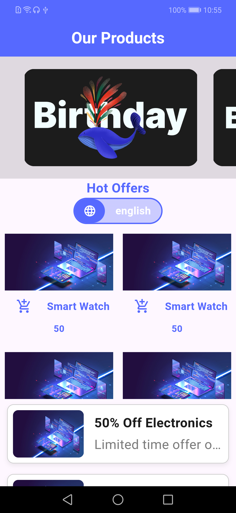
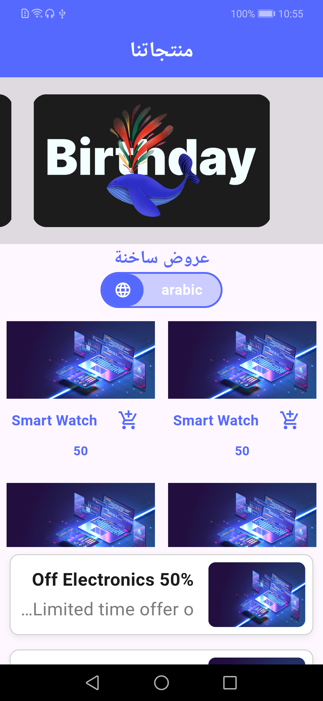
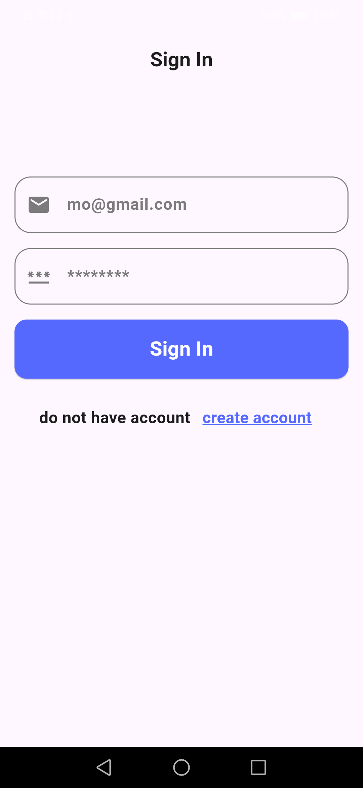
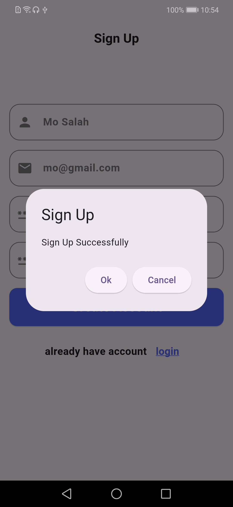

# My Shop Craft

This is a simple shopping app built with Flutter. It has a nice design and lets users sign up, sign in, and browse products.

✨ What My App Does (Features)

    Welcome Screen:

        Shows a welcome page with a title and two images (one from the internet, one from my computer).

        Uses a special font and has buttons to sign up or sign in.

    Sign Up & Sign In:

        Sign Up: You can create a new account by entering your name, email, and a password. It checks if everything is correct.

        Sign In: You can log in with an existing account.

        After you successfully log in or sign up, a small message pops up to say "success!"

    Smooth Transitions:

        When you log in, the screen changes with a nice fade-in effect instead of just jumping to the next page.

    Shopping Home Page:

        App Bar: At the top, it says "Our Products."

        Featured Products: You can swipe left and right to see special products.

        Product Grid: Below that, you can see all the products in a grid (two items per row).

        Product Cards: Each product has its own picture, title, and an "Add to Cart" button. When you click the button, a small message appears at the bottom of the screen.

        Hot Offers: There's a section with a list of special offers that you can scroll up and down.

🚀 How to Run the App

What you need:

    The Flutter SDK installed on your computer.

    A code editor like VS Code or Android Studio.

    A mobile phone or emulator to run the app.

Steps to get it working:

Get the code:
Open your terminal or command prompt and type:
Bash

    git clone https://github.com/your-username/your-repository-name.git

Go inside the project folder:
Bash

    cd your-repository-name

Get the necessary files:
This command downloads everything the project needs to run.
Bash

flutter pub get

Run the app:
Make sure your phone or emulator is connected, then type:
Bash

flutter run

Your app should now open!
### 📸 App Screenshots

| Welcome Screen |                     Shopping Page                     |                   Arabic Shopping Page                     |
| :---: |:-----------------------------------------------------:|:-----------------------------------------------------:|
|  |  |  |

| Sign-In Form |                     Dialog Screen                     |
| :---: |:-----------------------------------------------------:|
|  |  |